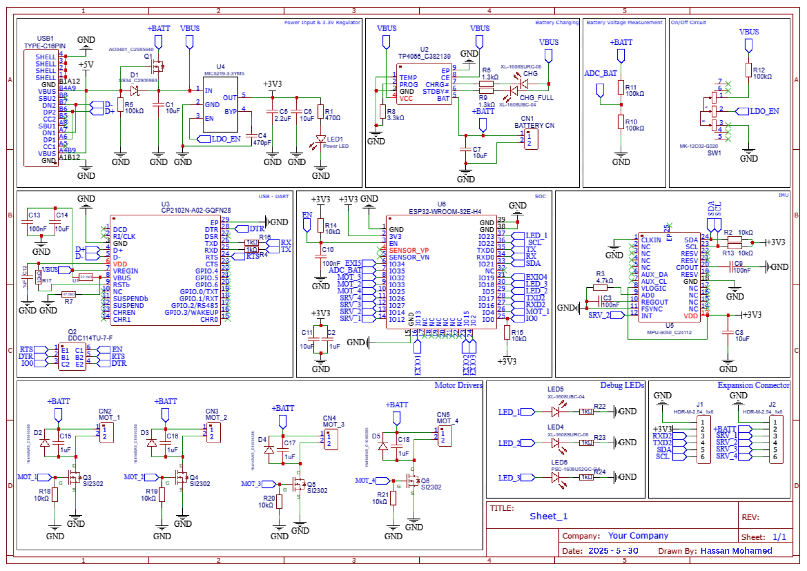
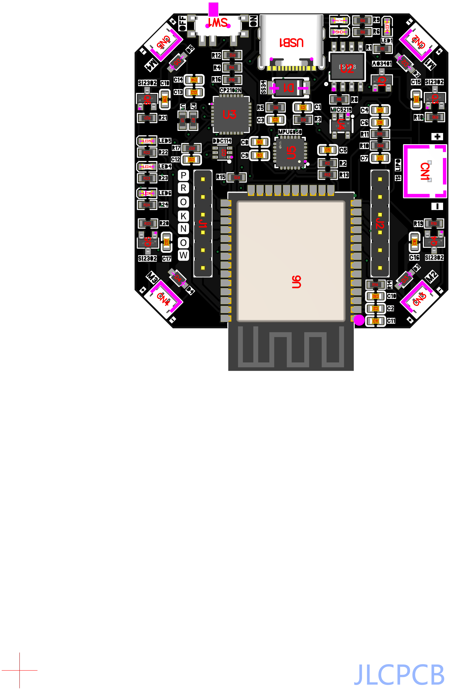

# PCB Drone Project Journal

**Author:** Hassan Mohamed  
**Project Start Date:** June 8, 2025  
**Total Time Spent:** 8 hours

---

## 📅 May 29, 2025

**🕒 Time Spent:** 3 hours  
**🛠️ Activities:**
- Defined project scope and goals  
- Installed and set up **KiCad**  
- Started designing the schematic for the power distribution and flight controller  
- Researched microcontroller options (leaning towards STM32 or ATmega328P)  

**📸 Media:**
  
*Screenshot of initial power schematic in KiCad*

---

## 📅 June 2, 2025

**🕒 Time Spent:** 2 hours  
**🛠️ Activities:**
- Completed schematic wiring  
- Started component footprint placement on PCB  
- Ensured proper sizing for ESC pads and XT60 connector  

**📸 Media:**
  
*Started laying out components in KiCad*

---

## 📅 June 8, 2025

**🕒 Time Spent:** 3 hours  
**🛠️ Activities:**
- Finalized PCB layout  
- Ran DRC checks  
- Generated Gerber files and prepared for JLCPCB order  

**📸 Media:**
  
*Preview of final PCB before sending for manufacturing*

---
